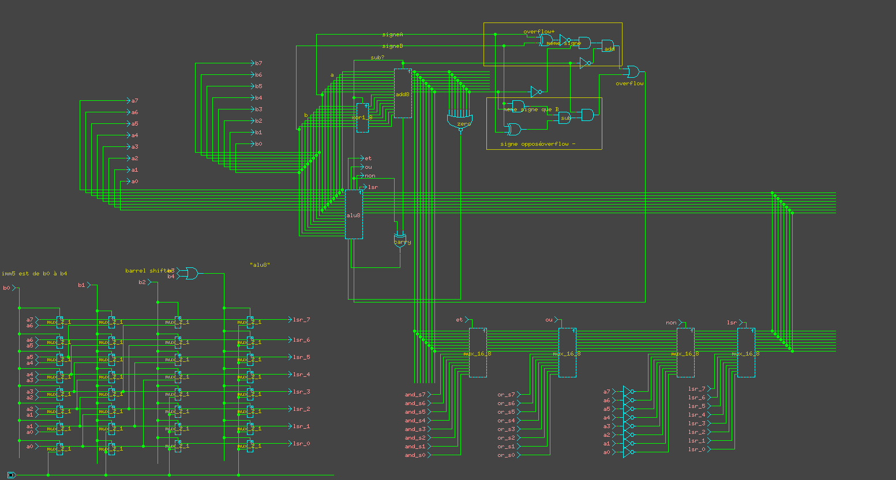
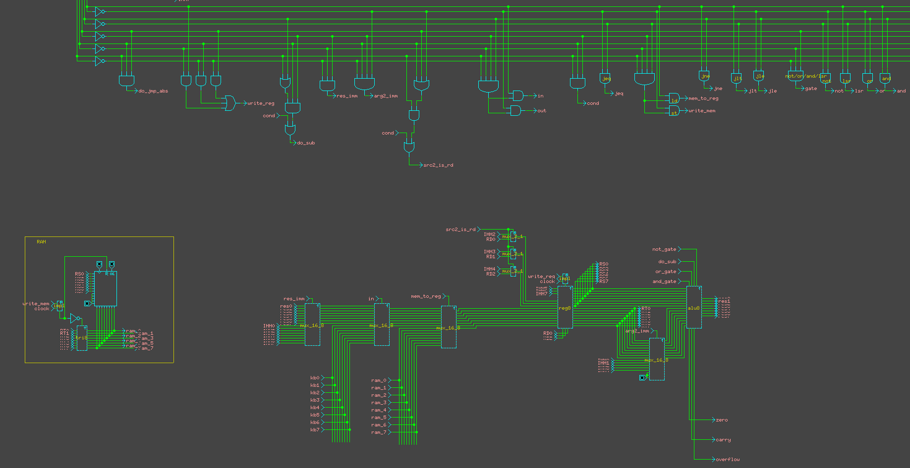

# My-Processor

This project is a class assignment at ENSIIE in the "hardware architecture" course.

The goal is to create our own processor using Diglog.

Besides division and multiplication from the last exercice, all other functionalities are implemented.

Assembly code was made to test the processor. It's located in the folder `test`.

    

    

## Disclaimer

The folder digcomp contains file to translate assembly code to binary code, it was given by the teacher of the

course and was not written by me.
